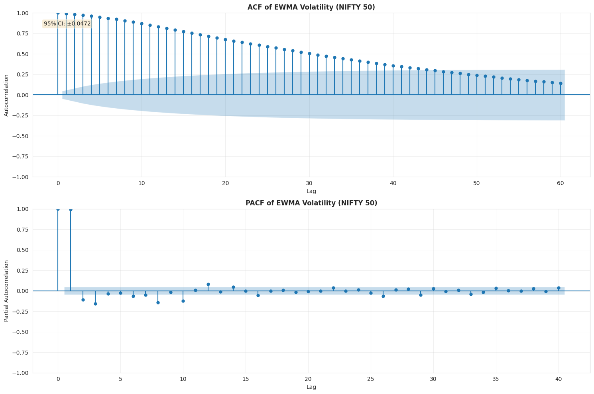
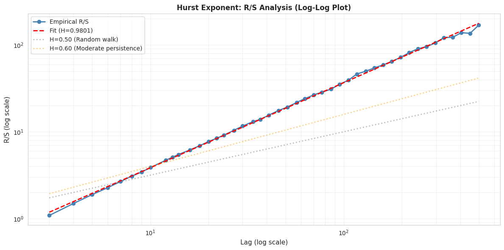
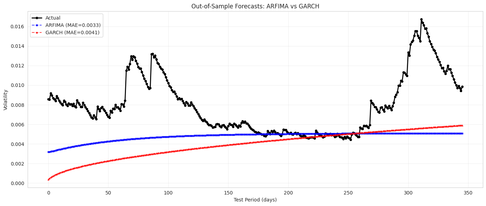
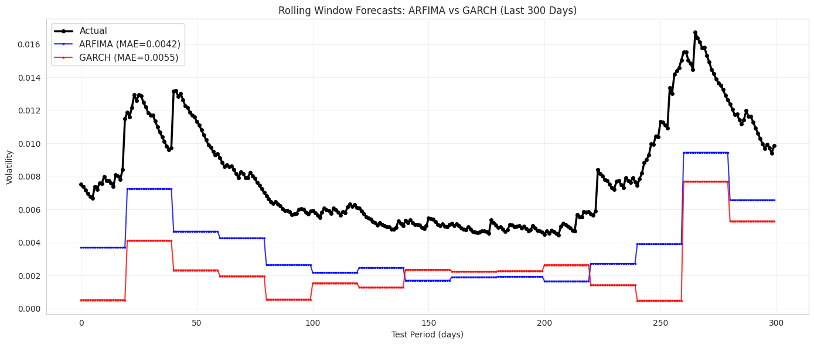

# ARFIMA vs GARCH: Volatility Modeling for NIFTY 50

[Read Full Report on GitHub Pages](https://nodonut6311.github.io/arfima-nifty50/)

A comprehensive comparative study of ARFIMA and GARCH(1,1) models for estimating and forecasting volatility in the NIFTY 50 equity index.

---

## Project Overview

This research analyzes 7 years of NIFTY 50 data (May 2019 - May 2026) to:
- Estimate conditional volatility using two competing frameworks
- Demonstrate ARFIMA's superiority in capturing long-memory persistence
- Develop practical hedging strategies for portfolio managers
- Provide actionable risk management recommendations

Key Finding: ARFIMA(3, 0.1, 0) outperforms GARCH(1,1) across 4 independent metrics, with 24% better out-of-sample forecasting accuracy.

---

## Quick Results

| Metric | ARFIMA | GARCH | Winner |
|--------|--------|-------|--------|
| AIC | -20,337 | -781 | ARFIMA |
| BIC | -20,310 | -759 | ARFIMA |
| Log-Likelihood | 10,173.6 | 394.3 | ARFIMA |
| MAE (Forecast) | 0.00420 | 0.00555 | ARFIMA (24% better) |
| RMSE (Forecast) | 0.00448 | 0.00610 | ARFIMA (27% better) |

---

## Key Visualizations

### ACF/PACF: Evidence of Long-Memory



### Hurst Exponent Analysis



### Static Forecasting (Problem)



### Rolling Window Forecasting (Solution)




## Methodology

### Data

- Source: NIFTY 50 Index (yfinance, ticker: ^NSEI)
- Period: May 30, 2019 - May 30, 2026
- Observations: 1,727 daily closing prices, 1,726 log returns
- Volatility Measure: EWMA with lambda=0.94 (RiskMetrics standard)

### ARFIMA Specification

Model: ARFIMA(3, 0.1, 0)

σ_t = 0.0048 + 0.9753*σ_(t-1) + 0.1146*σ_(t-2) - 0.1049*σ_(t-3) + ε_t

Long-Memory Parameter: d = 0.10 (derived from Hurst exponent H approximately 0.60)

### GARCH Specification

Model: GARCH(1,1)

σ_t^2 = ω + α*r_(t-1)^2 + β*σ_(t-1)^2

Issue: α + β = 1.0 (unit root, contradicting stationarity)

---

## Technical Stack

- Language: Python 3.12
- Data: yfinance
- Analysis: pandas, numpy, scipy, statsmodels
- Visualization: matplotlib, seaborn
- GARCH: arch library
- GitHub Pages: Jekyll with MathJax for LaTeX rendering

---
## Repository Structure
```
arfima-nifty50/
├── index.md                 # Full research report (GitHub Pages)
├── README.md               # Project overview and quick reference
├── images/
│   ├── g1.png             # Returns histogram with KDE
│   ├── g3.png             # ACF/PACF plots
│   ├── g4.png             # Hurst exponent R/S analysis
│   ├── g5.png             # Rolling window forecast (solution)
│   ├── g6.png             # Static forecast (problem)
│   └── ...
└── arfima_analysis.ipynb    # Full analysis code
```
----
## Citation

If you use this research, please cite:
ARFIMA vs GARCH: Volatility Modeling for NIFTY 50

GitHub Repository: https://github.com/nodonut6311/arfima-nifty50

Published: June 2026

---

## Contact and Questions

For questions or discussions about this research:
- Open an issue on GitHub
- Review the full report on GitHub Pages

---

Last Updated: June 2026
Status: Complete Research Project
