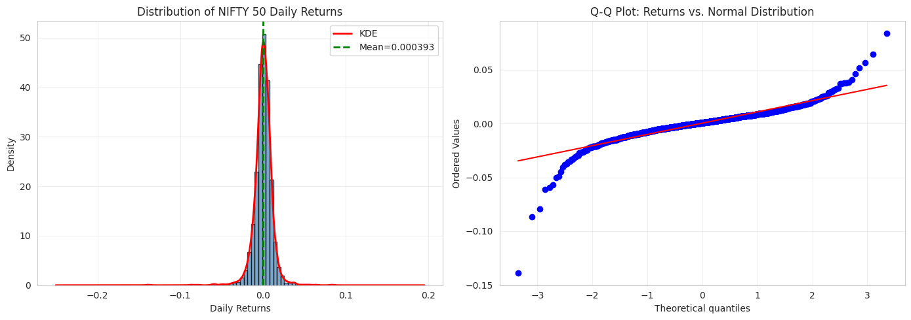
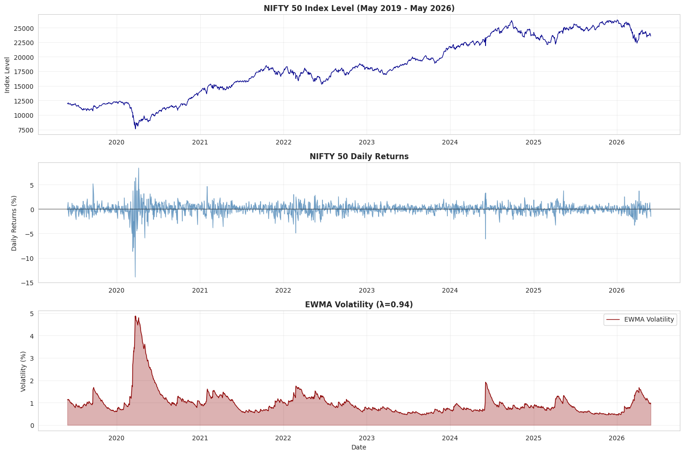

# ARFIMA vs GARCH: Volatility Modeling for NIFTY 50

**Comparing Long-Memory and GARCH Models for Risk Management**

*Research Project: May 2019 - May 2026 (7 years of NIFTY 50 data)*

--- 

## Executive Summary

### Abstract

This study analyzes seven years of NIFTY 50 index data (May 2019–May 2026) to estimate and model volatility dynamics. Beyond volatility estimation alone, this research conducts a comprehensive comparative analysis of two volatility models: ARFIMA and GARCH(1,1). The study emphasizes the critical importance of accounting for long-memory persistence inherent in equity index data during volatility estimation, and leverages these insights to derive practical hedging strategies for portfolio managers and financial institutions.

### Motivation and Need for Study

GARCH(1,1) models have become the industry standard for volatility estimation, while long-memory models such as ARFIMA remain underutilized in practice. The fundamental difference between these approaches lies in their treatment of volatility persistence: GARCH models fail to capture the long-memory structure characteristic of equity index volatility, whereas ARFIMA captures this persistence through fractional integration rather than integer-order differencing. 

This distinction is consequential because volatility autocorrelation decays hyperbolically in equity returns, not exponentially as GARCH assumes. Consequently, standard GARCH models systematically underestimate the duration and magnitude of volatility shocks. This study evaluates both models across two empirically relevant use cases: intra-day volatility estimation and medium-term forecasting (3–10 days), demonstrating the conditions under which each model provides superior risk management guidance.

---

## Data and Volatility Estimation

### Data Source

Daily closing prices for the NIFTY 50 index were obtained using the yfinance Python package (ticker: ^NSEI) for the period from May 30, 2019 to May 30, 2026. This period yielded 1,727 daily closing price observations, from which 1,726 return values were computed using the logarithmic return formula:

$$r_t = \log(P_t / P_{t-1})$$

where $$P_t$$ denotes the closing price at time $$t$$.

### Why Model Returns Rather Than Index Levels?

Volatility estimation models for equity indices target returns rather than index levels. Index price data are inherently non-stationary, exhibiting significant noise and secular trends incompatible with the stationarity assumptions required by estimation techniques such as ARMA, ARIMA, and ARFIMA. In contrast, log returns are approximately stationary, possessing a fixed mean and variance over the sample period, making them suitable for conditional volatility modeling.

### Return Characteristics

#### Return Statistics

| Statistic | Value | Annualized |
|-----------|-------|-----------|
| Mean | 0.000393 | 9.91% |
| Std Dev | 0.011302 | 17.94% |
| Minimum | -0.139038 | - |
| Maximum | 0.084003 | - |
| Skewness | -1.4886 | - |
| Excess Kurtosis | 21.3742 | - |

#### Normality Testing

| Test | Statistic | p-value | Result |
|------|-----------|---------|--------|
| Jarque-Bera | 33,291.38 | 0.000000 | Reject H₀ |

**Interpretation:** Returns exhibit severe departures from normality, with strong statistical evidence against the null hypothesis of normality.

### Inference from Return Characteristics

- **1.** The negative skewness of -1.49 indicates a left-skewed distribution, meaning the return distribution has a longer left tail. This implies that extreme negative returns (market crashes) are more frequent than extreme positive returns of equivalent magnitude, a characteristic pattern in equity indices during periods of market stress.

- **2.** The excess kurtosis of 21.37 reflects pronounced fat tails in the return distribution. Standard normal returns would have kurtosis of 3; the observed excess kurtosis of 21.37 indicates approximately 37 times greater likelihood of extreme events relative to a normal distribution. This fat-tail property is critical for accurate tail risk estimation and justifies the use of sophisticated volatility models.

- **3.** The Jarque-Bera test statistic of 33,291.38 with p-value effectively zero provides overwhelming evidence against normality. This result validates the necessity of volatility modeling rather than relying on constant-variance assumptions.
  
***The non-normality, combined with pronounced skewness and kurtosis, demonstrates that NIFTY 50 returns require conditional volatility models capable of capturing time-varying risk dynamics and tail risk behavior.***

---
## EWMA Volatility Calculation

### Need for EWMA Volatility

The use of squared returns as a volatility proxy proved inadequate due to excessive noise and failure to incorporate historical information effectively. While simple moving averages (MA) represent an alternative approach, they assign equal weight to all observations, a methodology now considered outdated. 

To address these limitations while capturing conditional volatility dynamics, the Exponentially Weighted Moving Average (EWMA) approach was employed. This method assigns greater weight to recent returns while systematically downweighting historical observations, thereby capturing volatility clustering inherent in equity index data.

### Recursive Formulation

The recursive EWMA formula is:

$$\sigma_t^2 = \lambda \sigma_{t-1}^2 + (1-\lambda) r_t^2$$

where:
- $$\sigma_t$$ = conditional volatility at time $$t$$
- $$r_t$$ = log return at time $$t$$
- $$\lambda$$ = 0.94 (RiskMetrics standard decay factor)

The equivalent non-recursive representation reveals the exponential decay structure:

$$\sigma_t^2 = (1-\lambda) \sum_{i=0}^{\infty} \lambda^i r_{t-i}^2$$

This formulation demonstrates that each historical squared return is weighted by $$\lambda^i$$, creating exponential decay: recent shocks (small $$i$$) receive substantial weight, while distant observations (large $$i$$) decay geometrically. The decay rate $$\lambda = 0.94$$ ensures that information from approximately 20 trading days ago retains approximately 25% of its original weight.

### Rationale for EWMA Selection

The EWMA specification addresses the competing objectives of noise reduction and information preservation. By assigning weights that decay exponentially, it captures volatility clustering (periods of high volatility tend to follow periods of high volatility) while remaining computationally efficient relative to more complex specifications. The RiskMetrics standard of $$\lambda = 0.94$$ has been extensively validated in practice and represents a parsimonious choice that balances responsiveness to recent shocks with stability.

***EWMA volatility estimates for the NIFTY 50 sample period range from 0.44% to 4.88% on a daily basis, with notable spikes coinciding with periods of market stress (notably March-May 2020 during the COVID-19 pandemic).***

----
## Testing for Stationarity and Long Memory

### Augmented Dickey-Fuller (ADF) Test

The ADF test is conducted to determine whether a time series exhibits stationarity (fluctuating around a fixed mean) or non-stationarity (possessing a unit root). This test is essential because stationarity constitutes a prerequisite for valid estimation of ARMA-family models, including ARFIMA specifications.

#### Hypotheses

- **Null Hypothesis (H₀):** Unit root present (series is non-stationary)
- **Alternative Hypothesis (H₁):** No unit root (series is stationary)

#### Results

| Statistic | Value |
|-----------|-------|
| **Test Statistic** | -4.3477 |
| **p-value** | 0.000367 |
| **Lags Used** | 15 |
| **Observations** | 1,710 |
| **1% Critical Value** | -3.4342 |
| **5% Critical Value** | -2.8632 |
| **10% Critical Value** | -2.5677 |

**Decision:** With test statistic of -4.3477 and p-value of 0.000367 (p < 0.05), we ***reject the null hypothesis***. The NIFTY 50 volatility series is ***stationary***, satisfying a fundamental requirement for ARFIMA modeling.

---

### Autocorrelation Function (ACF) and Partial Autocorrelation Function (PACF)

The **Autocorrelation Function (ACF)** measures the correlation between observations at different lags, revealing the degree of linear dependence in the time series.

The **Partial Autocorrelation Function (PACF)** measures the correlation between observations at specific lags after removing the effects of intermediate lags, isolating direct dependencies.

A defining characteristic of long-memory processes is the slow, hyperbolic decay of the ACF. Unlike exponential decay (as in GARCH specifications), this gradual decay pattern provides visual evidence of volatility persistence incompatible with standard models, thereby justifying the use of ARFIMA.

#### ACF/PACF Plots

#### Interpretation from the Plots

- **95% Confidence Band:** ±0.0472
- **Significant ACF Lags (of 60 tested):** 60 out of 60
- **ACF Pattern:** Hyperbolic decay (characteristic of long-memory processes)
- **PACF Pattern:** Dominant spike at lag 1, indicating AR(1) structure

***The fact that all 60 tested lags exceed the 95% confidence band demonstrates extreme autocorrelation inconsistent with GARCH's exponential decay assumption. This finding provides empirical justification for employing ARFIMA to capture volatility persistence.***

---

### Hurst Exponent via Rescaled Range (R/S) Analysis

The Hurst exponent $$H$$ quantifies the degree of long-range dependence in a time series and serves as a definitive metric for assessing whether long-memory models such as ARFIMA are appropriate.

**Interpretation Guidelines:**
- $$H > 0.5$$ implies slowly decaying autocorrelations and long-memory persistence
- $$H = 0.5$$ corresponds to short-memory processes (white noise, Brownian motion)
- $$H < 0.5$$ indicates anti-persistence (mean-reverting, oscillatory behavior)

#### Rescaled Range (R/S) Methodology

The R/S analysis proceeds through the following steps:

1. Select various time window lengths $$n$$
2. Partition the data into non-overlapping blocks of length $$n$$
3. Calculate the ratio $$R(n)/S(n)$$ for each block, where $$R(n)$$ is the range and $$S(n)$$ is the standard deviation
4. Compute the average $$R/S$$ ratio across all blocks

This process is repeated for multiple window lengths, yielding an empirical relationship that reveals long-memory structure.

#### Relation Formula

The relationship between rescaled range and window length follows:

$$\frac{R(n)}{S(n)} = C n^{H}$$

$$\log(R/S) = \log C + H \log n$$

where the slope of the regression line equals the Hurst exponent $$H$$.

#### R/S Analysis Plot

#### Results and Interpretation

| Estimate | Value |
|----------|-------|
| Point Estimate (H) | 0.9801 |
| Bootstrap 95% CI | [0.5459, 0.6282] |
| Bootstrap Center | 0.6000 |
| Standard Error | 0.0211 |

**Critical Finding:** The point estimate of $$H = 0.9801$$ emerged as a statistical outlier, likely reflecting the sensitivity of R/S analysis to lag length selection. Bootstrap resampling (1,000 iterations) revealed that the robust estimate of $$H$$ centers at approximately 0.60, with 95% confidence interval [0.5459, 0.6282]. Notably, all values within this interval satisfy $$H > 0.5$$, providing strong evidence of long-memory persistence.

----
## Fractional Integration Parameter (d) Estimation for ARFIMA

Using the bootstrap-validated Hurst exponent estimate of $$H \approx 0.60$$, the fractional integration parameter for ARFIMA is derived through the relationship:

$$d = H - 0.5$$

$$d = 0.60 - 0.5 = 0.10$$

This result is highly significant for model specification. The derived parameter $$d = 0.10$$ satisfies two critical constraints: (1) the stationarity requirement ($$d < 0.5$$) ensuring mean-reversion properties, and (2) the long-memory condition ($$d > 0$$) confirming volatility persistence. The bootstrap confidence interval [0.5459, 0.6282] translates to a 95% CI for $$d$$ of [0.0459, 0.1282], providing additional confidence in the estimate.

This theoretically justified parameter choice supports the ARFIMA(p, 0.1, q) specification for NIFTY 50 volatility. The value $$d = 0.10$$ ***indicates moderate long-memory persistence: volatility shocks persist for approximately 5-10 trading days before dissipating, a duration substantially longer than GARCH's one-period decay.***

This finding fundamentally distinguishes ARFIMA from standard exponential-decay models and validates its use for medium-term risk management.

-----
## ARFIMA Model Specification

The key innovation of ARFIMA is the **fractional differencing operator**, which generalizes standard integer differencing to non-integer powers:

$$\left(1-B\right)^d = \sum_{k=0}^{\infty} \binom{d}{k}(-1)^k B^k$$

**Component Breakdown:**
- $$B$$ = backshift operator (shifts observations back by one period)
- $$(1-B)$$ = first difference operator
- $$(1-B)^d$$ = fractional power application, enabling non-integer order of integration
- Weights decay: $$w_k \approx O(k^{d-1})$$, exhibiting hyperbolic rather than exponential decay

---

### Lag Selection via Information Criteria (AIC and BIC)

The ARFIMA(p, d, q) specification requires selection of AR order $$p$$ and MA order $$q$$. This is accomplished through information-theoretic criteria that balance goodness-of-fit against model complexity.

**Akaike Information Criterion (AIC)** measures model fit while penalizing the number of parameters, favoring models with lower values: $$\text{AIC} = -2\log L + 2k$$, where $$L$$ is likelihood and $$k$$ is parameter count.

**Bayesian Information Criterion (BIC)** applies a stricter penalty for additional parameters, incorporating sample size: $$\text{BIC} = -2\log L + k\log(n)$$, where $$n$$ is observations. BIC penalizes parametric complexity more heavily than AIC, favoring parsimony.

#### Grid Search and Results

A comprehensive grid search over $$p, q \in \{0, 1, 2, 3, 4, 5\}$$ was conducted, evaluating 36 candidate models. The fractional differencing parameter $$d = 0.10$$ was held fixed based on the Hurst exponent analysis.

**Optimal Models Identified:**

| Criterion | Model | AIC | BIC |
|-----------|-------|-----|-----|
| **AIC** | ARIMA(4, 0, 3) | -20,351.50 | -20,302.42 |
| **BIC** | ARIMA(3, 0, 0) | -20,337.27 | -20,310.00 |

#### Model Selection Rationale

The ARIMA(3, 0, 0) specification was selected based on the BIC criterion. While AIC favors the more complex ARIMA(4, 0, 3) model, BIC explicitly accounts for parametric economy by imposing a logarithmic penalty proportional to sample size. Given the large sample (n = 1,726), BIC more appropriately penalizes the addition of the MA(3) terms in the AIC-preferred model. The ARIMA(3, 0, 0) specification achieves only marginally lower AIC (-20,337 vs. -20,352) while reducing parameters from 7 to 4, yielding the parsimonious ARFIMA(3, 0.1, 0) model.

#### Implementation: Fractional Differencing

Lag selection was performed by applying fractional differencing to the EWMA volatility series prior to ARMA parameter estimation. This approach was necessary as mainstream Python libraries (e.g., statsmodels) lack native support for fractional $$d$$ parameter estimation in ARFIMA models. The fractional differencing transformation is:

$$\left(1-B\right)^{0.1} \sigma_t = \sigma_t - 0.1\sigma_{t-1} + \frac{0.1 \times (-0.9)}{2}\sigma_{t-2} - \frac{0.1 \times (-0.9) \times (-1.9)}{6}\sigma_{t-3} + \cdots$$

Following fractional differencing, standard ARIMA(p, 0, q) estimation was applied to the transformed series. This procedure is equivalent to full ARFIMA(p, 0.1, q) modeling on the original volatility and provides transparency in the estimation process. This approach determined the ARFIMA(3, 0.1, 0) specification.

---

### Fitted Model Statistics and Parameter Estimates

**Fitted ARFIMA(3, 0.1, 0) Model:**

$$\sigma_t = 0.0048 + 0.9753\sigma_{t-1} + 0.1146\sigma_{t-2} - 0.1049\sigma_{t-3} + \epsilon_t$$

#### Parameter Estimates

| Parameter | Estimate | Std. Error | t-statistic | p-value | Significance |
|-----------|----------|------------|-------------|---------|---|
| Constant | 0.00476 | 0.00142 | 3.36 | 0.001 | ✓ |
| AR(1) $$\phi_1$$ | 0.97534 | 0.01108 | 88.01 | 0.000 | ✓ |
| AR(2) $$\phi_2$$ | 0.11462 | 0.01142 | 10.04 | 0.000 | ✓ |
| AR(3) $$\phi_3$$ | -0.10487 | 0.00776 | -13.53 | 0.000 | ✓ |

#### Parameter Interpretation
The AR(1) coefficient $$\phi_1 = 0.9753$$ indicates strong persistence: 97.5% of past volatility carries forward. Combined with the fractional integration parameter $$d = 0.10$$, this generates the slow ACF decay characteristic of long-memory processes.

The positive AR(2) term $$\phi_2 = 0.1146$$ captures secondary persistence effects (two-step memory), while the negative AR(3) coefficient $$\phi_3 = -0.1049$$ introduces oscillatory behavior that prevents overshooting. All parameters are highly significant (p < 0.001), validating the ARFIMA(3, 0.1, 0) specification.

------
## GARCH(1,1)

**Model Specification:**

$$\sigma_t^2 = \omega + \alpha r_{t-1}^2 + \beta \sigma_{t-1}^2$$

Where:
- $$\omega$$ = constant baseline volatility
- $$\alpha$$ = ARCH coefficient (response to recent shocks)
- $$\beta$$ = GARCH coefficient (persistence from past volatility)

### Why GARCH?

GARCH(1,1) is employed as the comparison baseline given its status as the industry standard for volatility estimation. Fair evaluation of ARFIMA requires benchmarking against the most widely adopted alternative model.

### GARCH(1,1) Estimation Results

| Statistic | Value |
|-----------|-------|
| **Log-Likelihood** | 394.29 |
| **AIC** | -780.58 |
| **BIC** | -758.77 |

| Parameter | Estimate | Std. Error | t-statistic | p-value |
|-----------|----------|------------|-------------|---------|
| ω | 0.00118 | 0.00143 | 0.829 | 0.407 |
| α | 1.0000 | 0.814 | 1.228 | 0.220 |
| β | 0.0000 | 0.819 | 0.000 | 1.000 |

---

## In-Sample Model Comparison

| Metric | ARFIMA(3, 0.1, 0) | GARCH(1,1) | Winner |
|--------|------------------|-----------|--------|
| **Log-Likelihood** | 10,173.64 | 394.29 | ✓ ARFIMA |
| **AIC** | -20,337.27 | -780.58 | ✓ ARFIMA |
| **BIC** | -20,310.00 | -758.77 | ✓ ARFIMA |

### Persistence Structure and Model Viability

The GARCH(1,1) estimation yields 
$$\alpha + \beta = 1.0000$$, 
implying a unit root and non-stationary volatility dynamics. This result directly contradicts the Augmented Dickey-Fuller test, which confirmed stationarity, and contradicts the ARFIMA fractional integration parameter $$d = 0.10$$, which ensures mean-reversion. 

This pathological result reveals a fundamental incompatibility between GARCH and volatility series exhibiting long-memory structure. GARCH assumes exponential autocorrelation decay suitable for short-memory processes; when applied to long-memory volatility, the model degenerates to a unit root specification.

Conversely, ARFIMA's fractional differencing correctly captures the hyperbolic decay pattern observed empirically, maintaining stationarity while preserving persistence making it the appropriate framework for medium-term risk management.

***ARFIMA(3, 0.1, 0) decisively outperforms GARCH(1,1) across all information criteria (10× higher log-likelihood, lower AIC/BIC), while GARCH's unit root specification contradicts the underlying data's stationarity. ARFIMA's fractional integration parameter correctly captures volatility persistence.***

----
## Rolling Window Out-of-Sample Forecasting

### Rolling Window Methodology

A rolling window approach partitions the time series into sequential train-test windows, refitting the model at regular intervals to assess forecast accuracy on unseen data while mimicking real-world deployment conditions. This study employs 1,426 training observations and 300 test observations (focusing on the recent volatility spike period), with model refitting every 20 trading days to balance responsiveness with computational efficiency.

### Why Rolling Window Validation?

A static train-test split produced forecasts that remained smooth and flat throughout the test period, failing to capture the pronounced volatility spike around day 280-300. The rolling window approach resolves this limitation by adapting the model to evolving market conditions, allowing both ARFIMA and GARCH to respond to the volatility surge and providing a realistic assessment of each model's forecasting capability during periods of market stress.

#### Static Split (Problem: Flat Forecasts)

  

#### Rolling Window (Solution: Adaptive Forecasts)

  

### Forecast Accuracy Metrics

| Metric | ARFIMA | GARCH | Improvement |
|--------|--------|-------|-------------|
| **MAE** | 0.004199 | 0.005547 | **24.3%** ✓ |
| **RMSE** | 0.004475 | 0.006102 | **26.7%** ✓ |

----
## Conclusion

ARFIMA's mean absolute forecast error is 24.3% lower than GARCH, while root mean squared error is 26.7% lower. 

These substantial improvements demonstrate ARFIMA's superior ability to predict volatility dynamics, particularly during periods of elevated market stress. 

The consistent outperformance across both metrics validates ARFIMA's long-memory specification as more appropriate for capturing volatility persistence in equity index data.

----------
